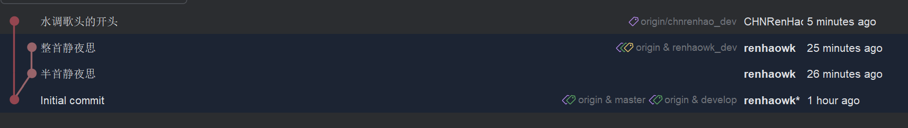
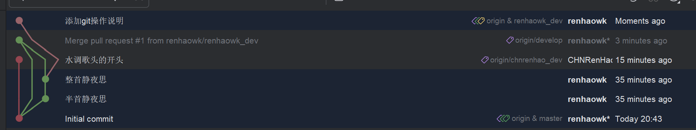
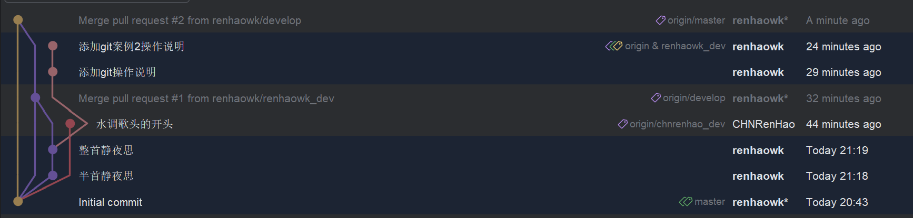
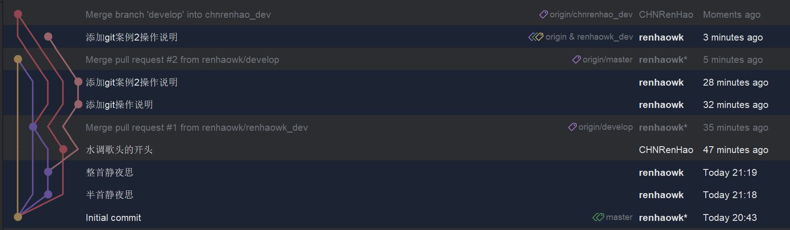
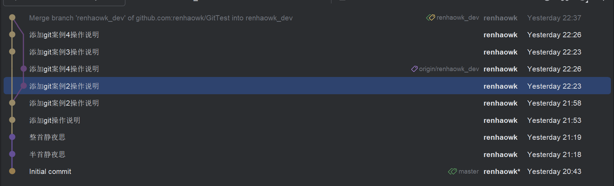
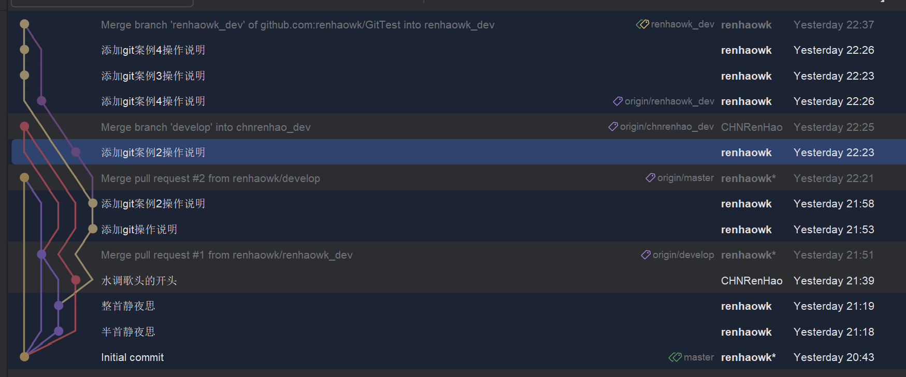
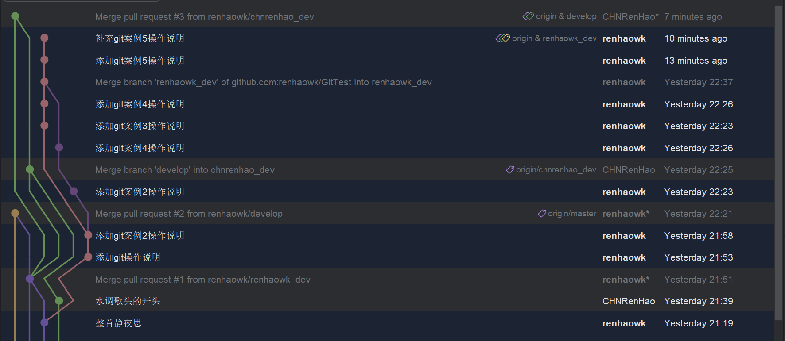
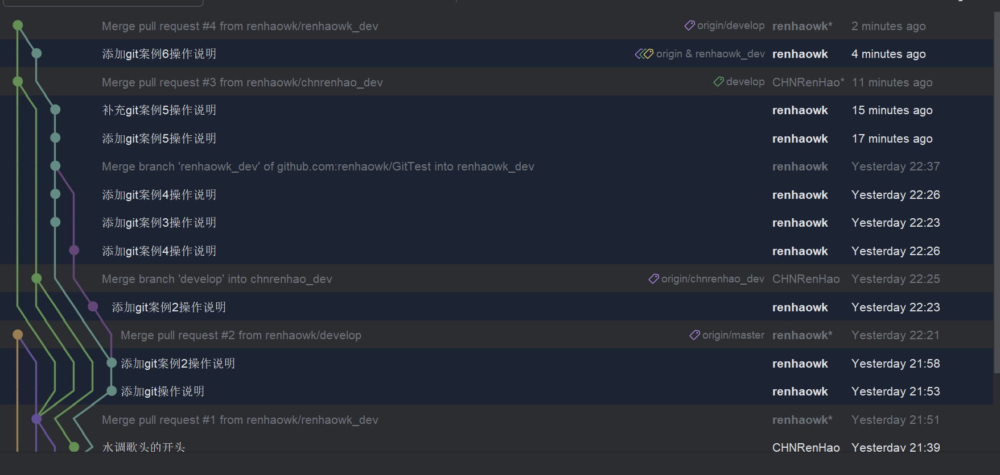
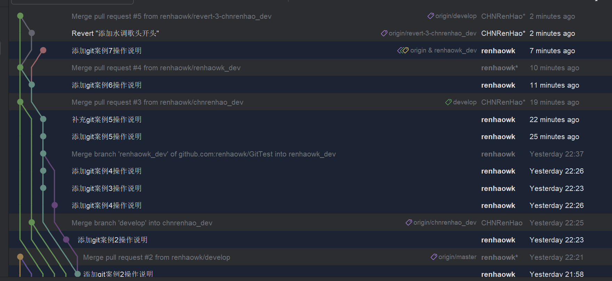

## Git操作
### 案例1
1. renhaowk_dev完成静夜思
2. chnrenhao_dev完成水调歌头开头后并各自push之后

### 案例2
1. renhaowk_dev提交PR到develop
2. renhaowk_dev添加了案例1的操作说明

### 案例3
1. merge develop到master
2. renhaowk_dev添加了案例2的操作说明

### 案例4
1. chnrenhao_dev merge了develop

### 案例5
1. 修改选中commit的commit message
因为既有的commit无法修改，只能从正确的“添加git案例2操作说明”后新建一个commit，命名为“添加git案例3操作说明”，同时创建后续节点并merge
#### renhaowk_dev分支视角

#### 所有分支视角

### 案例6
1. chnrenhao_dev提交PR到develop

### 案例7
1. renhaowk_dev提交PR到develop

### 案例8
1. 因为chnrenhao_dev的PR中水调歌头不完整，因此先revert PR
